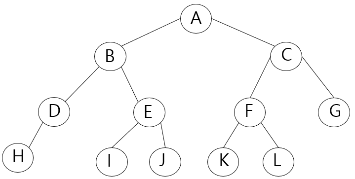

# 자료구조/알고리즘 공부 기록

#### 참고 도서: 자료구조와 함께 배우는 알고리즘 입문 자바편 - 보요 시바타 (이지스퍼블리싱)

<a href="https://www.bigocheatsheet.com/">Big O 그래프 및 정렬 알고리즘의 시간복잡도</a>

### n개의 여왕 알고리즘 (etc.QueenAlgorithm.java)
- 각 행과 열에 퀸을 하나씩 놓되, 서로 잡아먹을 수 없도록 위치하는 경우의 수 구하기

## 정렬 
- 안정된 정렬: 같은 값의 키를 가진 요소의 순서가 정렬 전/후에도 유지됨
- 불안정한 정렬: 안정된 정렬과 달리 요소의 순서가 유지되지 않고 흐트러짐
- 내부 정렬: 정렬할 모든 데이터를 하나의 배열에 저장할 수 있는 경우에 사용할 수 있는 알고리즘
- 외부 정렬: 데이터가 너무 많아서 하나의 배열에 저장할 수 없는 경우에 사용하는 알고리즘
- 정렬 알고리즘의 핵심 요소: 교환, 선택, 삽입
#### 버블정렬 (Sort.BubbleSort.java)
- 이웃한 두 요소의 대소관계를 비교하여 교환을 반복함
- 알고리즘 개선1: 내부 for문에서 교환이 이루어지지 않았다면 정렬 종료
- 알고리즘 개선2: 정렬을 마친 요소의 인덱스를 기억했다가 다음 수행할 검사의 범위를 제한

#### 단순선택정렬 (Sort.SelectionSort.java)
- 가장 작은 요소부터 시작해 알맞은 위치로 옮겨서 순서대로 정렬

#### 단순삽입 정렬/셔틀정렬 (Sort.ShuttleSort.java)
- 선택한 요소를 앞쪽의 알맞은 위치 삽입하는 작업을 반복
- 단점: 삽입할 위치가 멀리 떨어져 있으면 이동해야 하는 횟수가 많아짐

#### 셸 정렬(Sort.ShellSort.java)
- 단순 삽입 정렬을 개선해서 속도를 빠르게 함
- 증분값(h)을 기준으로 그룹을 나눠 정렬하고 증분값을 감소시켜서 다시 정렬하는 과정 반복
- 점점 정렬된 상태에 가까워짐
- 단순삽입정렬에 비해서는 매우 빠르지만 멀리 떨어져 있는 요소를 교환해야 하므로 안정적이지 않음

#### 퀵 정렬 (Sort.QuickSort.java)
- 피벗 기준으로 한 분할 정복 => 한 부분씩 점차적으로 정렬하는 방식
- 피벗값을 기준으로 좌우 정렬(swap) 후, 좌/우 각각의 피벗값을 기준으로 정렬하는 과정 반복 
- 재귀적/비재귀적 두 가지 방법
 
#### 병합 정렬 (Sort.MergeSort.java) 
- 중앙값을 기준으로 분할 정렬 후 병합 과정 반복
- 쪼갤 수 있는 가장 작은 단위(2개) 계속 분할
- 작업용 배열에 좌측 배열 복사 후 우측배열과 비교하며 정렬
- 정렬되면 쪼갠 순서 역순으로 반복

#### 힙 정렬 (Sort.HeapSort.java)
- 힙은 완전이진트리 (부모의 값은 자식의 값보다 항상 큼, 혹은 작음) 
- 부모의 값 >= 자식의 값
- 배열을 힙상태로 만든 후 힙의 특성을 사용해서 정렬
- 힙상태 특징: 전체 구조 뿐만 아니라 트리를 작은 부분으로 나눠서 봐도 위의 조건 충족되어야 함
- 힙상태가 되면 항상 root는 최댓값(혹은 최솟값)을 가지기 때문에 정렬하기가 쉬움
- 정렬 순서: 배열을 힙상태로 만듦 -> a[0]은 max값이므로 배열 마지막(n-1)과 swap의 과정을 범위를 좁혀가며 반복

#### 도수 정렬 (Sort.FrequencySort.java) 
- 데이터 비교, 교환 작업이 필요없어 매우 빠름
- 단일 for루프만 사용 
- 최솟값 혹은 최대값을 알아야함
- if문 대신 for문만을 사용해 정렬할 수 있는 
- 도수분포표 -> 누적도수분포표 -> 목적배열 -> 배열 복사 순서로 정렬

## 집합 (etc.IntSet.java)
#### etc.IntSet : 배열로 집합 클래스 만들기

## 문자열 검색 (etc.StringSearch.java)
#### 브루트-포스법
- 텍스트에서 패턴을 검색하는 단순하고 쉬운 알고리즘
- 성능은 좋지 않음 
#### KMP법
- 브루트-포스법을 개선해서 좀 더 효율적이지만 복잡하고 성능이 우수하지 않음
- 스킵 테이블 만들어야 함 
- 일치한 패턴을 버리지 않고 기억
#### Boyer-Moore법: <a href = "https://devwooks.tistory.com/12">(참고)</a> 
- KMP법보다 효율이 더 우수
- KMP와 마찬가지로 스킵테이블을 만들어야 함
- 비교할 필요가 확실히 없는 요소들은 건너뜀(스킵)
- 검색어(pattern)가 길수록 성능이 좋으나, 현실에서는 검색어가 짧은 경우가 많음

## 연결리스트 
#### 포인터로 만든 연결리스트 (LinkedList.LinkedList.java)
- 각 노드의 포인터는 다음 노드를 가리킴 (객체 참조)
- 메모리 영역을 만들고 해제하는 비용이 듬
- 포인터로 만든 연결리스트 테스터 (LinkedList.LinkedListTester.java)
#### 커서로 만든 연결 리스트 (LinkedList.ArrLinkedList.java)
- 리스트를 배열로 구현
- 데이터 수가 크게 바뀌지 않고 데이터 수의 최댓값을 미리 알 수 있을 경우 효율적
- 커서는 다음 노드에 대한 포인터가 아니라 다음 요소가 들어있는 인덱스 값
- 배열의 순서는 연결리스트의 순서와 상관 없음
- 단점: 앞쪽의 노드는 찾을 수 없음
- 연결리스트 테스터 (LinkedList.ArrLinkedListTester.java)

#### 원형 이중 연결리스트 (LinkedList.DoubleLinkedList.java)
- 노드의 앞쪽(prev)과 다음(next)를 검색할 수 있음
- head는 더미노드를 가리킴
- head.prev()는 꼬리 노드를, head.next()는 머리 노드를 선택노드로 변경
- 리스트가 비어있을 경우 prev, next는 모두 head를 가리킴
- 이중 연결 리스트 테스터 (LinkedList.DoubleLinkedListTester.java)

## 트리 Tree
 
#### 너비 우선 탐색 Breadth First Search, BFS
- 낮은 레벨에서 시작해 왼쪽에서 오른쪽 방향으로 검색하고 한 레벨에서의 검색이 끝나면 다음 레벨로 내려감
- 탐색 순서(위 트리 그림 참고): A - B - C - D - E - F - G - H - I - J - K - L

#### 깊이 우선 탐색 Depth First Search, DFS
- 리프까지 내려가면서 검색하는 것을 우선순위로 함
- 마지막 리프까지 도달해 더이상 검색을 진행할 곳이 없는 경우에는 부모에게로 돌아감
- 그런 다음 다시 남은 자식의 노드로 내려감
- 하나의 노드를 최대 3회 지나감
- 언제 노드를 방문할지 다음의 세 가지 종류로 구분
    1. 전위 순회 (Preorder) 방식: 노드 방문 -> 왼쪽 자식 -> 오른쪽 자식
    - 탐색 순서: A - B - D - H - E - I - J - C - F - K - L - G
    2. 중위 순회 (Inorder) 방식: 왼쪽 자식 -> 노드 방문 -> 오른쪽 자식
    - 탐색 순서: H - D - B - I - E - J - A - K - F - L - C - G
    3. 후위 순회 (Postorder) 방식: 왼쪽 자식 -> 오른쪽 자식 -> (돌아와) 노드 방문
    - 탐색 순서: H - D - I - J - E - B - K - L - F - G - C - A 

#### 이진트리 Binary Tree
- 왼쪽 자식과 오른쪽 자식을 구분함
- 마지막 레벨을 제외한 레벨은 노드를 가득 채움
- 마지막 레벨은 왼쪽부터 오른쪽 방향으로 채우되 끝까지 채울 필요는 없음

#### 이진검색트리, Binary Search Tree (BinarySearchTree.java)
- 어떤 노드 N을 기준으로 왼쪽 서브트리 노드의 모든 키 값은 노드 N의 키 값보다 작아야 함
- 레벨을 가득 채울 필요 없음
- 오른쪽 서브 트리 노드의 키 값은 노드 N의 키 값보다 커야 함
- 같은 키 값을 갖는 노드는 없음
- 중위 순회를 하면 키 값의 오름차순으로 노드를 얻을 수 있음 (변경하면 내림차순으로도 가능)
- remove(K key) 메소드의 로직이 다소 복잡함: 자식 노드 유무의 경우의 수 세 가지를 고려해야 함
- 이진검색트리 테스터 (Tree.BinarySearchTreeTester.java)

## 해시 Hash
- 검색과 추가, 삭제도 효율적으로 수행 가능
- 새로운 값을 추가하더라도 다른 배열 요소를 옮기지 않아도 됨

#### 해시법 Hashing
- 해시법은 데이터를 저장할 위치(인덱스)를 간단한 연산으로 구하는 방법
- 해시값: 배열의 키 값을 배열의 요소수로 나눈 나머지, 데이터에 접근할 때 사용
- 해시 테이블: 해시값이 인덱스가 되도록 원래의 키 값을 저장한 배열
- 해시 함수(hash function): 키 값을 가지고 해시 값을 만드는 과정
- 버킷(bucket): 해시 테이블의 각 요소
- 충돌(collision): 저장할 버킷이 중복되는 현상. 키값과 해시값은 반드시 1대1 관계가 아니기 때문

#### 충돌에 대한 대처
- 체인법: 같은 해시 값을 갖는 요소를 연결 리스트로 관리
- 오픈 주소법: 빈 버킷을 찾을 때까지 해시를 반복

#### 체인법 Chaining, Open hashing (Tree.ChainHash.java)
- 같은 해시 값을 갖는 데이터를 연결 리스트에 의해 사슬모양으로 연결
- 오픈 해시법(open hashing)이라고도 함
- 체인해시 테스터 (Tree.ChainHashTester.java)
- 아래 그림은 값을 13으로 나누었을 때의 나머지를 해시값으로 가짐
- 예) 69, 17은 13으로 나누었을 때 나머지가 4이기 때문에 같은 해시값을 가짐 
  

#### 오픈 주소법 Open Addressing
- 충돌이 발생했을 때 재해시(rehashing)를 수행하여 비어이있는 버킷을 찾아내는 방법
- 닫힌 해시법(closed hashing) 이라고도 함
