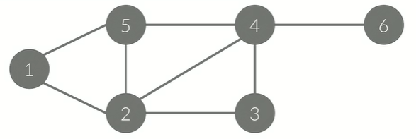

# 그래프(Graph)
- 자료구조의 일종
- 정점(Node, Vertex)
- 간선(Edge): 정점간의 관계를 나타낸다.
- G = (V, E)로 나타낸다.
- 경로(Path: 한 정점에서 다른 정점으로 가는 경로
- 사이클: 정점의 시작점과 도착점이 같은 경로

### 단순 경로와 단순 사이클 
- Simple Path and  Simple Cycle
- 경로/사이클에서 같은 정점을 두 번 이상 방문하지 않는 경로/사이클
- 특별한 말이 없으면, 일반적으로 사용하는 경로와 사이클은 단순 경로/사이클을 말한다.

### 방향 있는 그래프(Directed Graph)
- A->C와 같이 간선에 방향이 있다.
- A->C는 있지만 C->A는 없다.


### 방향 없는 그래프(Undirected Graph)
- A-C와 같이 간선에 방향이 없다.
- A-C는 A->C와 C->A를 나타낸다.
- 양방향 그래프(Bidirection Graph)라고도 한다.


### 가중치 (Weight)
- 간선 써있는 어떤 값
- `A에서 B로` 이동하는 거리, 이동하는 시간, 비용 등을 의미
- 가중치가 명시되어있지 않은 경우에는 1이라고 생각


### 차수(Degree)
- 정점과 연결되어 있는 간선의 개수
- 4의 In-degree: 3
- 4의 Out-degree: 1


## 그래프의 표현
- 아래와 같은 그래프는 정점이 6개, 간선이 8개 있다.
- 간선에 방향이 없기 때문에, 방향이 없는 그래프
- 정점: {1, 2, 3, 4, 5, 6} `// 간선의 수를 저장`
- 간선: {(1,2), (1,5), (2,5), (2,3), (3,4), (2,4), (4,5), (4,6)}



## 그래프 저장 방법
### 1. 인접 행렬(Adjacency-matrix)
- 점점의 개수를 V라고 했을 때
- V x V 크기의 이차원 배열을 이용
- A[i][j] = 1 (i->j 간선이 있을 때), 0(없을 때)
- 공간복잡도: O(V^2) `// 이차원배열이기 때문`
- 하나의 정점과 연결된 모든 간선을 구하는 시간: O(V)
- 임의의 두 정점 사이에 간선의 존재 유무를 구하는 시간이 인접리스트에 비해 빠름


### 2. 인접 리스트(Adjacency-list)
- 리스트를 이용해서 구현한다.
- A[i]=i 와 연결된 정점을 리스트로 포함하고 있음 
    - 리스트를 사용하는 이유: 간선이 몇개가 있을지 알 수 없기 때문
- 가중치가 있는 경우 간선 정점 번호와 가중치를 함께 저장
- Java에서는 ArrayList, C++에서는 Vector, Python에서는 list를 사용
- 인접 행렬에 비해서 공간복잡도와 시간복잡도가 우수하기 때문에 보통 사용

## 그래프의 탐색
목적: 임의의 정점에서 시작해서 연결되어있는 모든 정점을 `한 번씩` 방문하는 것
### 1. DFS(Depth First Search, 깊이 우선 탐색)
- 하나의 정점에서 시작해서 최대한 깊이 방문하고 더 이상 갈 곳이 없으면 돌아와서 진행하는 방식
- Stack을 사용
- Stack의 역할: 더 이상 갈 곳이 없을 때 어디로 돌아가야 하는지 기록
- 더 이상 방문할 곳이 없는 정점은 stack에서 제거
- 방문한 정점을 기록하는 배열이 필요: ex) int[] check
- stack이 empty가 되면 탐색 종료 (모든 정점 방문 완료)
- 재귀함수 사용
- 인접 행렬를 이용한 구현
```java
void dfs(int x) {
    check[x] = true;
    for (int i = 1; i <= n; i++) {
        if (a[x][i] == 1 && check[i] == false) {
            dfs(i);
        }
    }
}
```
- 인접 리스트를 이용한 구현
```java
void dfs(int x) {
    check[x] = true;
    for (int i = 0; i < a[x].size(); i++) {
        int y = a[x][i];
        if (check[y] == false) {
            dfs(y);
        }
    }
}
```
### 2. BFS(Breadth First Search, 너비 우선 탐색)
- 한 번에 여러 정점을 방문하는 방식 
- Queue를 사용
- 큐를 이용해서 지금 위치에서 갈 수 있는 것을 모두 큐에 넣는 방식
- 큐에 넣을 때 방문했다고 체크해야 함
- 큐가 empty되면 탐색 종료 (모든 정점 방문 완료)
- 인접 행렬을 이용한 구현
```java
Queue<Integer> q;
check[1] = true; 
q.push(1); 
while (!q.empty()) {
    int x = q.front();
    q.pop();
    for (int i = 1; i <= n; i++) {
        if (a[x][i] == 1 && check[i] == false) {
            check[i] = true;
            q.push(i);
        }
    }
}
```
- 인접 리스트를 이용한 구현
```java
Queue<Integer> q;
check[1] = true; 
q.push(1); 
while (!q.empty()) {
    int x = q.front();
    q.pop();
    for (int i = 0; i < a[x].size(); i++) {
        int y = a[x][i];
        if (check[y] == false) {
            check[y] = true;
            q.push(y);
        }
    }
}
```