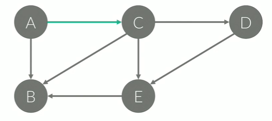
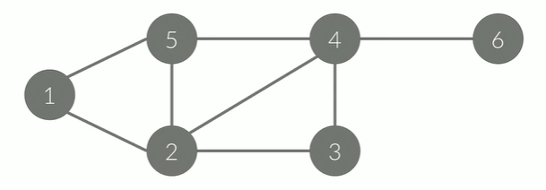

#그래프(Graph)
- 자료구조의 일종
- 정점(Node, Vertex)
- 간선(Edge): 정점간의 관계를 나타낸다.
- G = (V, E)로 나타낸다.
- 경로(Path: 한 정점에서 다른 정점으로 가는 경로
- 사이클: 정점의 시작점과 도착점이 같은 경로

### 단순 경로와 단순 사이클 
- Simple Path and  Simple Cycle
- 경로/사이클에서 같은 정점을 두 번 이상 방문하지 않는 경로/사이클
- 특별한 말이 없으면, 일반적으로 사용하는 경로와 사이클은 단순 경로/사이클을 말한다.

### 방향 있는 그래프(Directed Graph)
- A->C와 같이 간선에 방향이 있다.
- A->C는 있지만 C->A는 없다.

### 방향 없는 그래프(Undirected Graph)
- A-C와 같이 간선에 방향이 없다.
- A-C는 A->C와 C->A를 나타낸다.
- 양방향 그래프(Bidirection Graph)라고도 한다.

### 가중치 (Weight)
- 간선 써있는 어떤 값
- `A에서 B로` 이동하는 거리, 이동하는 시간, 비용 등을 의미
- 가중치가 명시되어있지 않은 경우에는 1이라고 생각

### 차수(Degree)
- 정점과 연결되어 있는 간선의 개수
- 4의 In-degree: 3
- 4의 Out-degree: 1

## 그래프의 표현
- 아래와 같은 그래프는 정점이 6개, 간선이 8개 있다.
- 간선에 방향이 없기 때문에, 방향이 없는 그래프
- 정점: {1, 2, 3, 4, 5, 6} `// 간선의 수를 저장`
- 간선: {(1,2), (1,5), (2,5), (2,3), (3,4), (2,4), (4,5), (4,6)}

