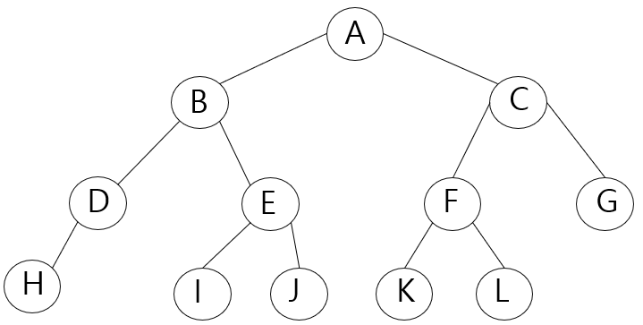
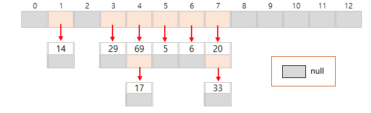

# 자료구조 공부 기록

## 연결리스트 
#### 포인터로 만든 연결리스트
- [LinkedList.java](/src/data_structure/linked_list/LinkedList.java)
- 각 노드의 포인터는 다음 노드를 가리킴 (객체 참조)
- 메모리 영역을 만들고 해제하는 비용이 듬
- 포인터로 만든 연결리스트 테스터 (LinkedList.LinkedListTester.java)
#### 커서로 만든 연결 리스트
- [ArrLinkedList.java](/src/data_structure/linked_list/ArrLinkedList.java)
- 리스트를 배열로 구현
- 데이터 수가 크게 바뀌지 않고 데이터 수의 최댓값을 미리 알 수 있을 경우 효율적
- 커서는 다음 노드에 대한 포인터가 아니라 다음 요소가 들어있는 인덱스 값
- 배열의 순서는 연결리스트의 순서와 상관 없음
- 단점: 앞쪽의 노드는 찾을 수 없음
- 연결리스트 테스터 (LinkedList.ArrLinkedListTester.java)

#### 원형 이중 연결리스트
- [DoubleLinkedList.java](/src/data_structure/linked_list/DoubleLinkedList.java)
- 노드의 앞쪽(prev)과 다음(next)를 검색할 수 있음
- head는 더미노드를 가리킴
- head.prev()는 꼬리 노드를, head.next()는 머리 노드를 선택노드로 변경
- 리스트가 비어있을 경우 prev, next는 모두 head를 가리킴
- 이중 연결 리스트 테스터 (LinkedList.DoubleLinkedListTester.java)

## 트리 Tree

#### 너비 우선 탐색 Breadth First Search, BFS
- 낮은 레벨에서 시작해 왼쪽에서 오른쪽 방향으로 검색하고 한 레벨에서의 검색이 끝나면 다음 레벨로 내려감
- 탐색 순서(위 트리 그림 참고): A - B - C - D - E - F - G - H - I - J - K - L

#### 깊이 우선 탐색 Depth First Search, DFS
- 리프까지 내려가면서 검색하는 것을 우선순위로 함
- 마지막 리프까지 도달해 더이상 검색을 진행할 곳이 없는 경우에는 부모에게로 돌아감
- 그런 다음 다시 남은 자식의 노드로 내려감
- 하나의 노드를 최대 3회 지나감
- 언제 노드를 방문할지 다음의 세 가지 종류로 구분
    1. 전위 순회 (Preorder) 방식: 노드 방문 -> 왼쪽 자식 -> 오른쪽 자식
    - 탐색 순서: A - B - D - H - E - I - J - C - F - K - L - G
    2. 중위 순회 (Inorder) 방식: 왼쪽 자식 -> 노드 방문 -> 오른쪽 자식
    - 탐색 순서: H - D - B - I - E - J - A - K - F - L - C - G
    3. 후위 순회 (Postorder) 방식: 왼쪽 자식 -> 오른쪽 자식 -> (돌아와) 노드 방문
    - 탐색 순서: H - D - I - J - E - B - K - L - F - G - C - A 

#### 이진트리 Binary Tree
- 왼쪽 자식과 오른쪽 자식을 구분함
- 하나의 노드는 두 개 이하의 자식을 가짐
- 모두 채울 필요는 없음

#### 완전이진트리 Complete Binary Tre
- 마지막 레벨을 제외한 레벨은 노드를 가득 채움
- 마지막 레벨은 왼쪽부터 오른쪽 방향으로 노드를 채우되 끝까지 채울 필요는 없음

#### 이진검색트리
- [BinarySearchTree.java](/src/data_structure/tree/BinarySearchTree.java)
- 어떤 노드 N을 기준으로 왼쪽 서브트리 노드의 모든 키 값은 노드 N의 키 값보다 작아야 함
- 레벨을 가득 채울 필요 없음
- 오른쪽 서브 트리 노드의 키 값은 노드 N의 키 값보다 커야 함
- 같은 키 값을 갖는 노드는 없음
- 중위 순회를 하면 키 값의 오름차순으로 노드를 얻을 수 있음 (변경하면 내림차순으로도 가능)
- remove(K key) 메소드의 로직이 다소 복잡함: 자식 노드 유무의 경우의 수 세 가지를 고려해야 함
- 이진검색트리 테스터 (Tree.BinarySearchTreeTester.java)

## 해시 Hash
- 검색과 추가, 삭제도 효율적으로 수행 가능
- 새로운 값을 추가하더라도 다른 배열 요소를 옮기지 않아도 됨

#### 해시법 Hashing
- 해시법은 데이터를 저장할 위치(인덱스)를 간단한 연산으로 구하는 방법
- 해시값: 배열의 키 값을 배열의 요소수로 나눈 나머지, 데이터에 접근할 때 사용
- 해시 테이블: 해시값이 인덱스가 되도록 원래의 키 값을 저장한 배열
- 해시 함수(data_structure.etc.hash function): 키 값을 가지고 해시 값을 만드는 과정
- 버킷(bucket): 해시 테이블의 각 요소
- 충돌(collision): 저장할 버킷이 중복되는 현상. 키값과 해시값은 반드시 1대1 관계가 아니기 때문

#### 충돌에 대한 대처
- 체인법: 같은 해시 값을 갖는 요소를 연결 리스트로 관리
- 오픈 주소법: 빈 버킷을 찾을 때까지 해시를 반복

#### 체인법 Chaining, Open hashing
- [ChainHash.java](/src/data_structure/hash/ChainHash.java)
- 같은 해시 값을 갖는 데이터를 연결 리스트에 의해 사슬모양으로 연결
- 오픈 해시법(open hashing)이라고도 함
- 체인해시 테스터 (Tree.ChainHashTester.java)
- 아래 그림은 값을 13으로 나누었을 때의 나머지를 해시값으로 가짐
- 예) 69, 17은 13으로 나누었을 때 나머지가 4이기 때문에 같은 해시값을 가짐 

#### 오픈 주소법 Open Addressing
- 충돌이 발생했을 때 재해시(rehashing)를 수행하여 비어있는 버킷을 찾아내는 방법
- 닫힌 해시법(closed hashing) 이라고도 함
